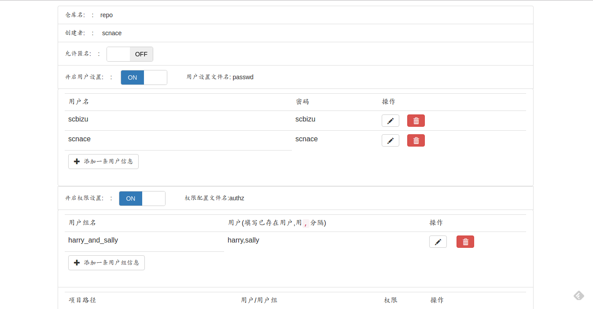

# svnpanel

A  light auth management tool for svn implement by Golang.

## Arch

### list

> use `svnlook` command ,and implement `svnlook` wrapper functions .

0x00  列出所有svn repo

> Read conf directory and show some useful configurations .

0x01  列出当前repo的一些设置

* SVNROOT/conf/svnserve.conf

  * **是否允许匿名登录**  : 读取`anon-access`的值,如果`anon-access`被注释掉(即`#anon-access=xxx`,svn创建repo时的默认设置。),则被认为开启匿名登录(值不为`none`都被认为是匿名登录);

  * ~~**匿名用户文件读写权限** : 读取`auth-access`的值,如果值为`write`,那么通过验证(已登录)的用户都可以读和写;如果值为`read`,那么匿名的用户则不可以写(不能update到svn服务器)~~(feature deleted because of `anon-access` is always set `none`)

  * **开启用户设置(password)** ： 开启即可进行用户增删改查(即设置`password-db=passwd`)。

  * **开启权限设置(authz)** : 开启即可进行用户组的权限配置(即设置`authz-db=authz`)

* SVNROOT/conf/passwd

  当开启`passwd`后,获取`[users]`字段下内容,`json化`用户名 和 密码 .

* SVNROOT/conf/authz

 当开启`authz`后,读取 ~~`[aliases]`~~,`[groups]`,和 一些repo 目录的权限。

### config

> edit files under `conf` directory and  save to the conf .

0x02 异步修改conf设置

*  修改passwd文件

   处理前端发过来的json(`{"old":["username":"","password":""],"new":["username":"","password":""]}`),old用于查询要修改的帐号,new用来替换修改的帐号。

*  修改authz文件(暂不支持aliases)

## APIs

|Router     |Method|DataType| Service          |
|---|---|---|
|/config:repo|GET|JSON|查询选中版本库的详细信息|
|/repos|GET|JSON|查询全部版本库|
|/edit|PUT|JSON|修改svnserve.conf的字段|
|/passwd|POST|JSON|修改passwd下的用户名和密码|
|/newpasswd|POST|JSON|passwd下添加新的用户|
|/delpasswd|POST|JSON|删除passwd下的某个用户信息|
|/groups|POST|JSON|修改authz下group字段下的用户组设置|
|/addgroup|POST|JSON|增加一个用户组|
|/delgroup|POST|JSON|删除一个用户组|
|/editauth|POST|JSON|修改一个路径的权限|
|/delauth|POST|JSON|删除一条权限|
|/addauth|POST|JSON|增加一条权限|

## How To

配置文件位于根目录下 文件名是 svnadmin.json

key的生成规则是 `密码?盐?`

盐可以自定义

## preview

